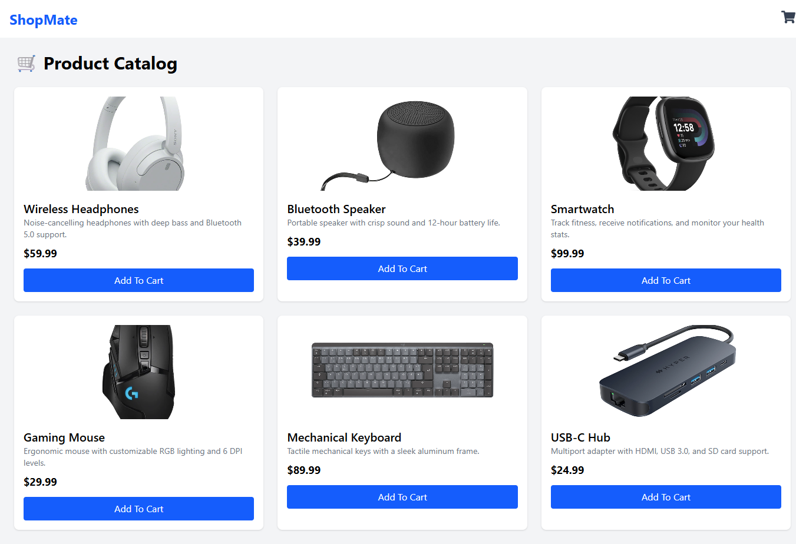

# 🛒 Shopping Cart UI

A React shopping cart app built as part of **Brad Traversy's Modern React course**. This app applies modern React practices including **Context API** for state management, and uses **json-server** to serve mock product data.

---

## 🚀 Features

- **Product listing page** with data fetched from a mock API
- Add and remove products from the **shopping cart**
- **Context API** for global state management (avoids prop drilling)
- Responsive, modern UI design
- Lightweight backend simulation with **json-server**

---

## 🛠️ Technologies Used

- **React (Hooks & Functional Components)**
- **React Context API**
- **json-server** (mock backend API)
- **CSS / Tailwind**

---

## 📷 Screenshot



---

## ⚙️ Installation & Setup

Clone the repo:

```bash
git clone https://github.com/your-username/shopping-cart-ui.git
cd shopping-cart-ui
```
